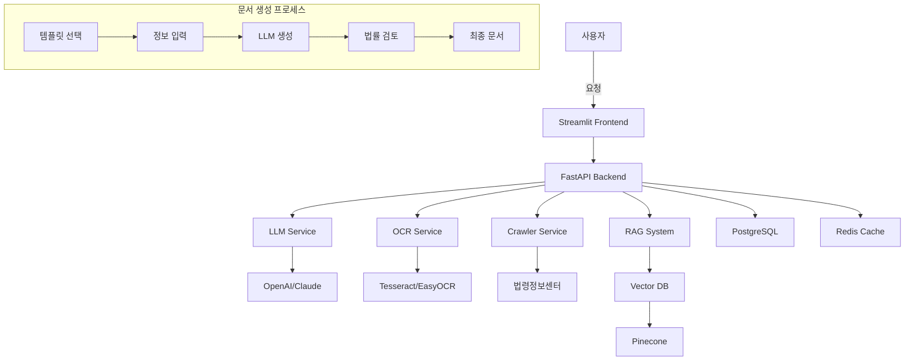

# 🏛️ 법률 문서 자동화 시스템 (Legal Document Automation System)

## 📋 프로젝트 개요
AI 기반 법률 문서 자동 생성 및 검토 SaaS 플랫폼

### 🎯 핵심 목표
- 계약서, 소장, 내용증명 등 법률 문서 자동 생성
- 법률 조항 검색 및 추천 시스템
- 문서 리스크 자동 분석
- OCR을 통한 기존 문서 디지털화

## 🛠️ 기술 스택

### Backend
- **Framework**: FastAPI (Python 3.11+)
- **Database**: PostgreSQL + Redis + Pinecone (Vector DB)
- **LLM**: OpenAI GPT-4, Claude, Legal-BERT
- **OCR**: Tesseract, EasyOCR
- **Crawler**: BeautifulSoup, Selenium

### Frontend
- **Framework**: Streamlit / React
- **UI Components**: Material-UI
- **Charts**: Plotly, Chart.js

### Infrastructure
- **Container**: Docker, Docker Compose
- **CI/CD**: GitHub Actions
- **Monitoring**: Prometheus, Grafana

## 📁 프로젝트 구조

```
legal-automation-system/
├── backend/
│   ├── app/
│   │   ├── api/                    # API 엔드포인트
│   │   │   ├── v1/
│   │   │   │   ├── documents.py    # 문서 관련 API
│   │   │   │   ├── laws.py         # 법률 조항 API
│   │   │   │   ├── analysis.py     # 분석 API
│   │   │   │   └── templates.py    # 템플릿 API
│   │   │   └── deps.py             # 의존성 주입
│   │   ├── core/                   # 핵심 설정
│   │   │   ├── config.py          # 환경 설정
│   │   │   ├── security.py        # 보안 설정
│   │   │   └── logging.py         # 로깅 설정
│   │   ├── models/                 # 데이터베이스 모델
│   │   │   ├── document.py        # 문서 모델
│   │   │   ├── template.py        # 템플릿 모델
│   │   │   ├── law.py             # 법률 조항 모델
│   │   │   └── user.py            # 사용자 모델
│   │   ├── schemas/                # Pydantic 스키마
│   │   │   ├── document.py
│   │   │   ├── template.py
│   │   │   └── law.py
│   │   ├── services/               # 비즈니스 로직
│   │   │   ├── llm/               # LLM 서비스
│   │   │   │   ├── generator.py   # 문서 생성
│   │   │   │   └── analyzer.py    # 리스크 분석
│   │   │   ├── ocr/               # OCR 서비스
│   │   │   │   └── processor.py   # 문서 처리
│   │   │   ├── crawler/           # 크롤링 서비스
│   │   │   │   └── law_crawler.py # 법령 크롤러
│   │   │   ├── rag/               # RAG 시스템
│   │   │   │   ├── indexer.py     # 벡터 인덱싱
│   │   │   │   └── retriever.py   # 검색 엔진
│   │   │   └── generator/         # 문서 생성
│   │   │       ├── contract.py    # 계약서 생성
│   │   │       ├── lawsuit.py     # 소장 생성
│   │   │       └── notice.py      # 내용증명 생성
│   │   └── utils/                  # 유틸리티
│   │       ├── validators.py      # 검증 함수
│   │       └── formatters.py      # 포맷터
│   ├── database/                   # 데이터베이스
│   │   ├── migrations/            # Alembic 마이그레이션
│   │   └── init_db.py            # DB 초기화
│   ├── tests/                     # 테스트
│   ├── requirements.txt           # 의존성
│   └── main.py                    # FastAPI 앱 엔트리
├── frontend/
│   ├── pages/                     # 페이지 컴포넌트
│   │   ├── home.py               # 홈 페이지
│   │   ├── generator.py          # 문서 생성
│   │   ├── search.py             # 법률 검색
│   │   ├── analyzer.py           # 리스크 분석
│   │   └── dashboard.py          # 대시보드
│   ├── components/                # UI 컴포넌트
│   │   ├── document_editor.py    # 문서 편집기
│   │   ├── template_selector.py  # 템플릿 선택
│   │   └── risk_report.py        # 리스크 리포트
│   ├── assets/                    # 정적 자원
│   └── app.py                     # Streamlit 메인
├── data/
│   ├── templates/                 # 문서 템플릿
│   │   ├── contracts/            # 계약서 템플릿
│   │   ├── lawsuits/             # 소장 템플릿
│   │   └── notices/              # 내용증명 템플릿
│   ├── documents/                 # 생성된 문서
│   ├── laws/                      # 법률 조항 DB
│   └── vectors/                   # 벡터 DB
├── scripts/
│   ├── crawl_laws.py             # 법률 크롤링 스크립트
│   ├── init_templates.py         # 템플릿 초기화
│   └── build_vectors.py          # 벡터 DB 구축
├── docs/
│   ├── API.md                    # API 문서
│   ├── LEGAL_TEMPLATES.md        # 템플릿 가이드
│   └── USER_GUIDE.md             # 사용자 가이드
├── docker-compose.yml
├── .env.example
└── README.md
```

## 🚀 주요 기능

### 1. 문서 자동 생성
- **계약서**: 근로계약서, 임대차계약서, 매매계약서 등
- **소장**: 민사소장, 지급명령신청서 등
- **내용증명**: 임금청구, 계약해지 통보 등

### 2. 법률 조항 검색/추천
- 키워드 기반 법률 조항 검색
- 문맥 기반 관련 조항 추천
- 최신 법령 업데이트 자동 반영

### 3. 리스크 분석
- 계약서 불리한 조항 검토
- 법적 리스크 포인트 자동 표시
- 개선 사항 제안

### 4. OCR 문서 처리
- PDF/이미지 → 텍스트 변환
- 문서 구조 자동 파싱
- 메타데이터 추출

## 📊 시스템 아키텍처



## 💼 사용 사례

### Use Case 1: 근로계약서 생성
```python
# 1. 템플릿 선택
template = "employment_contract"

# 2. 정보 입력
data = {
    "employer": "주식회사 테크스타트",
    "employee": "김개발",
    "position": "백엔드 개발자",
    "salary": 5000000,
    "start_date": "2024-01-01"
}

# 3. 문서 생성
contract = generate_document(template, data)

# 4. 리스크 분석
risks = analyze_risks(contract)

# 5. 최종 확인 및 다운로드
```

### Use Case 2: 법률 조항 검색
```python
# 키워드 검색
results = search_laws("임대차 계약 해지")

# RAG 기반 추천
context = "임대인이 보증금을 반환하지 않는 경우"
recommendations = get_legal_recommendations(context)
```

## 🔐 보안 및 컴플라이언스

- **데이터 암호화**: AES-256 암호화
- **접근 제어**: JWT 기반 인증
- **개인정보보호**: GDPR/개인정보보호법 준수
- **감사 로그**: 모든 문서 생성/수정 기록

## 📈 성능 목표

- 문서 생성 시간: < 30초
- 법률 검색 응답: < 2초
- 동시 사용자: 1000+
- 가용성: 99.9%

## 🔄 개발 로드맵

### Phase 1: MVP (2주)
- [x] 프로젝트 구조 설계
- [ ] 기본 문서 템플릿 구축
- [ ] LLM 문서 생성 엔진
- [ ] 간단한 UI 구현

### Phase 2: Core Features (2주)
- [ ] 법률 조항 크롤링
- [ ] RAG 시스템 구현
- [ ] 리스크 분석 기능
- [ ] OCR 문서 처리

### Phase 3: Production (1주)
- [ ] 성능 최적화
- [ ] 보안 강화
- [ ] 테스트 및 디버깅
- [ ] 배포 준비

## 🚦 Quick Start

### 1. 환경 설정
```bash
# 클론
git clone <repository>
cd legal-automation-system

# 가상환경 생성
python -m venv venv
source venv/bin/activate  # Windows: venv\Scripts\activate

# 의존성 설치
pip install -r backend/requirements.txt
```

### 2. 환경변수 설정
```bash
cp .env.example .env
# .env 파일에 API 키 설정
```

### 3. 데이터베이스 초기화
```bash
# PostgreSQL 실행
docker-compose up -d postgres

# 마이그레이션
cd backend
alembic upgrade head

# 초기 데이터 로드
python scripts/init_templates.py
python scripts/crawl_laws.py
```

### 4. 서버 실행
```bash
# Backend
cd backend
uvicorn app.main:app --reload

# Frontend
cd frontend
streamlit run app.py
```

### 5. Docker 실행 (선택)
```bash
docker-compose up -d
```

## 📝 라이선스
MIT License

## 👥 기여자
- AI 심화 캠프 2기 법률팀

## 📞 문의
legal-automation@example.com