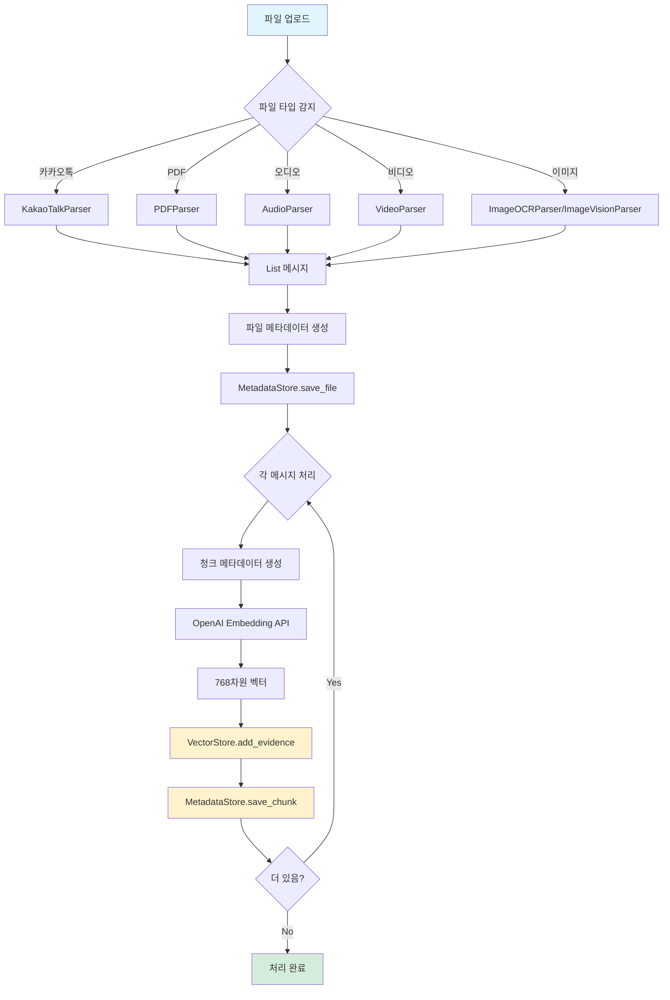

# LEH AI Pipeline - 데이터 플로우 다이어그램

시스템 내 데이터 흐름을 시각화한 다이어그램 모음

---

## 목차

- [전체 시스템 플로우](#전체-시스템-플로우)
- [파일 처리 플로우](#파일-처리-플로우)
- [검색 플로우](#검색-플로우)
- [분석 플로우](#분석-플로우)
- [케이스 격리 플로우](#케이스-격리-플로우)

---

## 전체 시스템 플로우

```
┌─────────────────────────────────────────────────────────────┐
│                        사용자/클라이언트                      │
└──────────┬────────────────────────┬─────────────────────────┘
           │                        │
           ↓ (파일 업로드)           ↓ (검색 요청)
┌──────────────────────┐   ┌──────────────────────┐
│  StorageManager      │   │  HybridSearchEngine  │
│  - process_file()    │   │  - search()          │
└──────┬───────────────┘   └──────┬───────────────┘
       │                          │
       ↓                          ↓
┌──────────────────────┐   ┌──────────────────────┐
│  Parsers (7개)       │   │  VectorStore         │
│  - KakaoTalk         │   │  + MetadataStore     │
│  - PDF               │   │  - search()          │
│  - Audio/Video       │   │  - where: case_id    │
│  - Image (OCR/Vision)│   └──────┬───────────────┘
└──────┬───────────────┘          │
       │                          ↓
       ↓ (List[Message])   ┌──────────────────────┐
┌──────────────────────┐   │  SearchResult        │
│  AnalysisEngine      │   │  + context_before    │
│  - analyze()         │   │  + context_after     │
│  - Scorer            │   └──────────────────────┘
│  - RiskAnalyzer      │
│  - Article840Tagger  │
│  - Summarizer        │
└──────┬───────────────┘
       │
       ↓ (AnalysisResult)
┌──────────────────────┐   ┌──────────────────────┐
│  Embedding (OpenAI)  │   │  LegalSearchEngine   │
│  - text-embedding    │   │  - 법률 조문 검색     │
└──────┬───────────────┘   └──────────────────────┘
       │
       ↓
┌──────────────────────────────────────────┐
│           Data Layer                     │
├──────────────────┬───────────────────────┤
│  MetadataStore   │  VectorStore          │
│  (SQLite)        │  (ChromaDB)           │
│  - files         │  - leh_evidence       │
│  - chunks        │  - 768d vectors       │
│  - case_id 인덱스│  - case_id 메타데이터  │
└──────────────────┴───────────────────────┘
```

---

## 파일 처리 플로우

### 1. 파일 업로드 → 파싱 → 저장



### 2. 세부 플로우: 비디오 파싱

```
┌─────────────┐
│ video.mp4   │
└──────┬──────┘
       │
       ↓
┌─────────────────────────────┐
│ VideoParser.parse()         │
└──────┬──────────────────────┘
       │
       ↓
┌─────────────────────────────┐
│ ffmpeg 오디오 추출          │
│ - 입력: video.mp4           │
│ - 출력: temp_audio.mp3      │
│ - 설정: mono, 16kHz         │
└──────┬──────────────────────┘
       │
       ↓
┌─────────────────────────────┐
│ 임시 파일 생성              │
│ - NamedTemporaryFile        │
│ - suffix=".mp3"             │
│ - delete=True (자동 삭제)   │
└──────┬──────────────────────┘
       │
       ↓
┌─────────────────────────────┐
│ AudioParser.parse()         │
│ - Whisper STT API 호출      │
│ - response_format: verbose  │
│ - timestamp_granularities   │
└──────┬──────────────────────┘
       │
       ↓
┌─────────────────────────────┐
│ List[Message]               │
│ - content: 음성 인식 텍스트 │
│ - timestamp: 세그먼트 시간  │
│ - sender: "Speaker"         │
└──────┬──────────────────────┘
       │
       ↓
┌─────────────────────────────┐
│ 임시 파일 자동 삭제         │
└─────────────────────────────┘
```

### 3. 에러 처리 및 롤백

```
┌─────────────────────┐
│ process_file()      │
└──────┬──────────────┘
       │
       ↓
┌─────────────────────┐
│ try:                │
│   파싱              │
│   메타데이터 저장   │
│   임베딩 생성       │
│   벡터 저장         │
└──────┬──────────────┘
       │
       ├─ 성공 ──→ 완료
       │
       ↓ (에러 발생)
┌─────────────────────┐
│ except:             │
│   _rollback_file()  │
└──────┬──────────────┘
       │
       ↓
┌─────────────────────────────────┐
│ 롤백 처리:                      │
│ 1. MetadataStore.delete_file()  │
│ 2. get_chunks_by_file()         │
│ 3. for each chunk:              │
│    - VectorStore.delete_by_id() │
│    - MetadataStore.delete_chunk│
└─────────────────────────────────┘
```

---

## 검색 플로우

### 1. 기본 검색 플로우

```
┌─────────────────┐
│ 검색 쿼리       │
│ + case_id       │
└────────┬────────┘
         │
         ↓
┌─────────────────────────────┐
│ StorageManager.search()     │
│ - query: "외도 증거"        │
│ - case_id: "case_001"       │
│ - top_k: 10                 │
└────────┬────────────────────┘
         │
         ↓
┌─────────────────────────────┐
│ get_embedding(query)        │
│ - OpenAI Embedding API      │
│ - model: text-embedding-3   │
│ - output: 768차원 벡터      │
└────────┬────────────────────┘
         │
         ↓
┌─────────────────────────────┐
│ VectorStore.search()        │
│ - query_embedding: [...]    │
│ - n_results: 10             │
│ - where: {case_id: "..."}   │ ← 케이스 격리
└────────┬────────────────────┘
         │
         ↓
┌─────────────────────────────┐
│ ChromaDB 검색               │
│ - Cosine 유사도 계산        │
│ - HNSW 인덱스 활용          │
│ - 메타데이터 필터링         │
└────────┬────────────────────┘
         │
         ↓
┌─────────────────────────────┐
│ 결과 포맷팅                 │
│ - content                   │
│ - metadata (file_id, ...)   │
│ - distance (유사도)         │
└────────┬────────────────────┘
         │
         ↓
┌─────────────────────────────┐
│ List[SearchResult]          │
└─────────────────────────────┘
```

### 2. 컨텍스트 확장 검색

```
┌────────────────────────────────────┐
│ SearchEngine.search()              │
│ - context_window: 2                │
└──────┬─────────────────────────────┘
       │
       ↓
┌────────────────────────────────────┐
│ 기본 벡터 검색                     │
│ → Top 10 결과                      │
└──────┬─────────────────────────────┘
       │
       ↓
┌────────────────────────────────────┐
│ for each result:                   │
│   chunk = result.chunk_id          │
│   file = result.file_id            │
└──────┬─────────────────────────────┘
       │
       ↓
┌────────────────────────────────────┐
│ 컨텍스트 청크 조회                 │
│ - get_chunks_by_file(file_id)      │
│ - 타임스탬프 기준 정렬             │
└──────┬─────────────────────────────┘
       │
       ↓
┌────────────────────────────────────┐
│ 전후 컨텍스트 추출                 │
│ - context_before: 이전 2개 메시지  │
│ - context_after: 이후 2개 메시지   │
└──────┬─────────────────────────────┘
       │
       ↓
┌────────────────────────────────────┐
│ SearchResult with Context          │
│ - chunk_id, content, distance      │
│ - context_before: ["msg1", "msg2"] │
│ - context_after: ["msg3", "msg4"]  │
└────────────────────────────────────┘
```

### 3. 하이브리드 검색 (증거 + 법률)

```
┌─────────────────────┐
│ HybridSearchEngine  │
│ .search()           │
└──────┬──────────────┘
       │
       ├──────────────────────────────┐
       │                              │
       ↓                              ↓
┌──────────────────┐         ┌──────────────────┐
│ EvidenceSearch   │         │ LegalSearch      │
│ - 사용자 증거    │         │ - 법률 조문      │
│ - case_id 필터   │         │ - 전체 법률 DB   │
└──────┬───────────┘         └──────┬───────────┘
       │                              │
       ↓                              ↓
┌──────────────────┐         ┌──────────────────┐
│ 증거 검색 결과   │         │ 법률 검색 결과   │
│ [result1, ...]   │         │ [result1, ...]   │
└──────┬───────────┘         └──────┬───────────┘
       │                              │
       └──────────────┬───────────────┘
                      │
                      ↓
         ┌────────────────────────┐
         │ 결과 통합 (Merge)      │
         │ - distance 기준 정렬   │
         │ - top_k 제한           │
         └────────┬───────────────┘
                  │
                  ↓
         ┌────────────────────────┐
         │ List[HybridResult]     │
         │ - source: evidence/legal│
         │ - content              │
         │ - distance             │
         └────────────────────────┘
```

---

## 분석 플로우

### 1. 종합 분석 파이프라인

```
┌──────────────────┐
│ List[Message]    │
│ (파서 출력)      │
└────────┬─────────┘
         │
         ↓
┌───────────────────────────────┐
│ AnalysisEngine.analyze()      │
└────────┬──────────────────────┘
         │
         ├─────────────────────────────────────┐
         │                                     │
         ↓                                     ↓
┌────────────────────┐              ┌─────────────────────┐
│ EvidenceScorer     │              │ RiskAnalyzer        │
│ .score_batch()     │              │ .analyze()          │
└────────┬───────────┘              └─────────┬───────────┘
         │                                     │
         ↓                                     ↓
┌────────────────────┐              ┌─────────────────────┐
│ 각 메시지 점수     │              │ 위험도 분석         │
│ - score: 0-10      │              │ - violence_risk     │
│ - keywords         │              │ - financial_risk    │
│ - categories       │              │ - custody_risk      │
└────────┬───────────┘              │ - overall_risk      │
         │                          └─────────┬───────────┘
         │                                     │
         └─────────────┬─────────────────────┘
                       │
                       ↓
            ┌──────────────────────┐
            │ Article840Tagger     │
            │ .tag_batch()         │
            └──────────┬───────────┘
                       │
                       ↓
            ┌──────────────────────┐
            │ 법률 조항 분류       │
            │ - ADULTERY           │
            │ - DESERTION          │
            │ - ...                │
            └──────────┬───────────┘
                       │
                       ↓
            ┌──────────────────────┐
            │ EvidenceSummarizer   │
            │ (선택적)             │
            └──────────┬───────────┘
                       │
                       ↓
            ┌──────────────────────┐
            │ AnalysisResult       │
            │ - scored_messages    │
            │ - risk_analysis      │
            │ - tagged_messages    │
            │ - summary            │
            └──────────────────────┘
```

### 2. 증거 점수 산정 상세

```
┌─────────────────┐
│ Message         │
│ content: "..."  │
└────────┬────────┘
         │
         ↓
┌─────────────────────────────┐
│ EvidenceScorer.score()      │
└────────┬────────────────────┘
         │
         ↓
┌─────────────────────────────┐
│ 키워드 매칭                 │
│ - 이혼: 3.0                 │
│ - 폭력: 3.5                 │
│ - 금전: 2.5                 │
│ - 외도: 3.0                 │
│ - 학대: 3.0                 │
└────────┬────────────────────┘
         │
         ↓
┌─────────────────────────────┐
│ 점수 계산                   │
│ base = 0.5                  │
│ + (가중치 * 키워드 개수)    │
│ × 다중 카테고리 보너스      │
│ = raw_score                 │
└────────┬────────────────────┘
         │
         ↓
┌─────────────────────────────┐
│ 정규화                      │
│ final = min(raw_score, 10.0)│
└────────┬────────────────────┘
         │
         ↓
┌─────────────────────────────┐
│ ScoringResult               │
│ - score: float (0-10)       │
│ - matched_keywords: [...]   │
│ - categories: [...]         │
└─────────────────────────────┘
```

### 3. 위험도 분석 상세

```
┌──────────────────┐
│ List[Message]    │
└────────┬─────────┘
         │
         ↓
┌─────────────────────────────┐
│ RiskAnalyzer.analyze()      │
└────────┬────────────────────┘
         │
         ├─────────────────┬─────────────────┬─────────────────┐
         │                 │                 │                 │
         ↓                 ↓                 ↓                 ↓
┌────────────────┐ ┌────────────────┐ ┌────────────────┐ ┌────────────────┐
│ 폭력 위험      │ │ 금전 분쟁      │ │ 양육권 분쟁    │ │ 기타 위험      │
│ - 폭력 키워드  │ │ - 재산 키워드  │ │ - 양육 키워드  │ │               │
│ - 상해 키워드  │ │ - 금전 키워드  │ │ - 자녀 키워드  │ │               │
└────────┬───────┘ └────────┬───────┘ └────────┬───────┘ └────────┬───────┘
         │                 │                 │                 │
         ↓                 ↓                 ↓                 ↓
┌────────────────┐ ┌────────────────┐ ┌────────────────┐ ┌────────────────┐
│ 매칭 횟수 계산 │ │ 매칭 횟수 계산 │ │ 매칭 횟수 계산 │ │ 종합 평가      │
└────────┬───────┘ └────────┬───────┘ └────────┬───────┘ └────────┬───────┘
         │                 │                 │                 │
         ↓                 ↓                 ↓                 ↓
┌────────────────┐ ┌────────────────┐ ┌────────────────┐ ┌────────────────┐
│ RiskLevel:     │ │ RiskLevel:     │ │ RiskLevel:     │ │ RiskLevel:     │
│ 0-2: low       │ │ 0-2: low       │ │ 0-2: low       │ │ max(all)       │
│ 3-5: medium    │ │ 3-5: medium    │ │ 3-5: medium    │ │               │
│ 6-8: high      │ │ 6-8: high      │ │ 6-8: high      │ │               │
│ 9+: critical   │ │ 9+: critical   │ │ 9+: critical   │ │               │
└────────┬───────┘ └────────┬───────┘ └────────┬───────┘ └────────┬───────┘
         │                 │                 │                 │
         └─────────────────┴─────────────────┴─────────────────┘
                                    │
                                    ↓
                         ┌──────────────────┐
                         │ RiskAnalysis     │
                         │ - violence_risk  │
                         │ - financial_risk │
                         │ - custody_risk   │
                         │ - overall_risk   │
                         │ - indicators     │
                         └──────────────────┘
```

---

## 케이스 격리 플로우

### 1. 케이스 격리 저장

```
┌─────────────────────┐
│ process_file()      │
│ case_id: "case_001" │
└──────┬──────────────┘
       │
       ↓
┌─────────────────────────────────┐
│ EvidenceFile                    │
│ - file_id: uuid()               │
│ - case_id: "case_001" ←────────┤ 케이스 ID 포함
│ - filename, file_type, ...      │
└──────┬──────────────────────────┘
       │
       ↓
┌─────────────────────────────────┐
│ MetadataStore.save_file()       │
│ INSERT INTO evidence_files ...  │
└──────┬──────────────────────────┘
       │
       ↓
┌─────────────────────────────────┐
│ for each message:               │
│   EvidenceChunk                 │
│   - chunk_id: uuid()            │
│   - file_id: [same]             │
│   - case_id: "case_001" ←──────┤ 청크에도 케이스 ID
│   - content, timestamp, ...     │
└──────┬──────────────────────────┘
       │
       ↓
┌─────────────────────────────────┐
│ VectorStore.add_evidence()      │
│ metadata = {                    │
│   "case_id": "case_001", ←─────┤ 벡터 메타데이터에도
│   "file_id": ...,               │
│   "chunk_id": ...               │
│ }                               │
└──────┬──────────────────────────┘
       │
       ↓
┌─────────────────────────────────┐
│ MetadataStore.save_chunk()      │
│ INSERT INTO evidence_chunks ... │
└─────────────────────────────────┘
```

### 2. 케이스 격리 검색

```
┌─────────────────────┐
│ search()            │
│ case_id: "case_001" │
└──────┬──────────────┘
       │
       ↓
┌─────────────────────────────────┐
│ VectorStore.search()            │
│ where={"case_id": "case_001"}   │ ← 필터 적용
└──────┬──────────────────────────┘
       │
       ↓
┌─────────────────────────────────┐
│ ChromaDB Query                  │
│ - 벡터 유사도 계산              │
│ - 메타데이터 필터링:            │
│   if metadata.case_id !=        │
│      "case_001": SKIP ←─────────┤ 다른 케이스 배제
└──────┬──────────────────────────┘
       │
       ↓
┌─────────────────────────────────┐
│ Results                         │
│ [                               │
│   {case_id: "case_001", ...},   │ ✅ 동일 케이스만
│   {case_id: "case_001", ...},   │ ✅
│   {case_id: "case_001", ...}    │ ✅
│ ]                               │
│                                 │
│ ❌ case_002 데이터 없음         │ ← 격리 보장
└─────────────────────────────────┘
```

### 3. 케이스 격리 검증

```
┌─────────────────────────────┐
│ verify_case_isolation()     │
│ case_id: "case_001"         │
└──────┬──────────────────────┘
       │
       ↓
┌─────────────────────────────┐
│ VectorStore.get()           │
│ where={"case_id": "case_001"}│
│ include=["metadatas"]       │
└──────┬──────────────────────┘
       │
       ↓
┌─────────────────────────────┐
│ 모든 벡터 조회              │
│ results = [vec1, vec2, ...] │
└──────┬──────────────────────┘
       │
       ↓
┌─────────────────────────────┐
│ for vec in results:         │
│   if vec.metadata.case_id   │
│      != "case_001":         │
│     return False ←──────────┤ 데이터 누수 감지
└──────┬──────────────────────┘
       │
       ↓ (모두 일치)
┌─────────────────────────────┐
│ return True                 │ ← 격리 확인
└─────────────────────────────┘
```

### 4. 케이스 완전 삭제

```
┌─────────────────────────────┐
│ delete_case_complete()      │
│ case_id: "case_001"         │
│ vector_store: VectorStore   │
└──────┬──────────────────────┘
       │
       ↓
┌─────────────────────────────┐
│ 1. 청크의 vector_id 수집   │
│ chunks = get_chunks_by_case │
│ vector_ids = [              │
│   chunk.vector_id           │
│   for chunk in chunks       │
│   if chunk.vector_id        │
│ ]                           │
└──────┬──────────────────────┘
       │
       ↓
┌─────────────────────────────┐
│ 2. 벡터 삭제                │
│ for vector_id in vector_ids:│
│   vector_store              │
│     .delete_by_id(vector_id)│
└──────┬──────────────────────┘
       │
       ↓
┌─────────────────────────────┐
│ 3. 메타데이터 삭제          │
│ DELETE FROM evidence_chunks │
│ WHERE case_id = "case_001"  │
│                             │
│ DELETE FROM evidence_files  │
│ WHERE case_id = "case_001"  │
└─────────────────────────────┘
       │
       ↓
┌─────────────────────────────┐
│ 완전 삭제 완료              │
│ - 벡터: 0개                 │
│ - 청크: 0개                 │
│ - 파일: 0개                 │
└─────────────────────────────┘
```

---

## 시퀀스 다이어그램

### 전체 워크플로우 시퀀스

```
사용자     StorageManager   Parser   OpenAI    VectorStore   MetadataStore
  │              │            │        │           │              │
  │─ upload file ─>           │        │           │              │
  │              │            │        │           │              │
  │              │─ parse() ─>│        │           │              │
  │              │<─ messages ┤        │           │              │
  │              │            │        │           │              │
  │              │─ save_file() ───────────────────>              │
  │              │            │        │           │              │
  │              │─ embed() ──────────>│           │              │
  │              │<─ vector ───────────┤           │              │
  │              │            │        │           │              │
  │              │─ add_evidence() ────>           │              │
  │              │            │        │           │              │
  │              │─ save_chunk() ──────────────────>              │
  │              │            │        │           │              │
  │<─── result ──┤            │        │           │              │
  │              │            │        │           │              │
  │─ search() ───>            │        │           │              │
  │              │            │        │           │              │
  │              │─ embed(query) ──────>           │              │
  │              │<─ vector ───────────┤           │              │
  │              │            │        │           │              │
  │              │─ search(vector, where=case_id) ─>              │
  │              │<─ results ──────────────────────┤              │
  │              │            │        │           │              │
  │<─ results ───┤            │        │           │              │
```

---

## 성능 최적화 플로우

### 배치 처리

```
┌──────────────────────┐
│ 100개 메시지         │
└──────┬───────────────┘
       │
       ↓ (배치 단위로 처리)
┌──────────────────────┐
│ Batch 1 (10개)      │
│ ├─ 임베딩 생성      │ ← OpenAI API 1회 호출
│ ├─ 벡터 저장        │ ← add_evidences()
│ └─ 메타데이터 저장  │ ← save_chunks()
└──────┬───────────────┘
       ↓
┌──────────────────────┐
│ Batch 2 (10개)      │
│ ...                  │
└──────┬───────────────┘
       ↓
       ...
       ↓
┌──────────────────────┐
│ Batch 10 (10개)     │
└──────────────────────┘

성능 향상:
- API 호출 횟수: 100회 → 10회 (90% 감소)
- DB 트랜잭션: 100회 → 10회 (90% 감소)
```

---

## 참고 사항

- 모든 다이어그램은 실제 코드 구현을 기반으로 작성되었습니다
- 플로우는 간략화되어 있으며, 에러 처리 및 예외 상황은 생략되었습니다
- 실제 구현에서는 로깅, 모니터링, 재시도 로직 등이 추가됩니다
